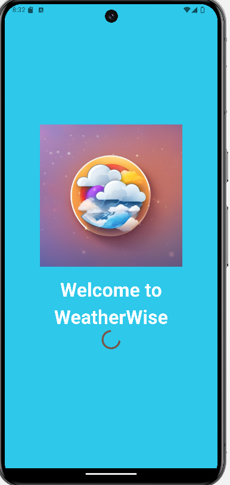
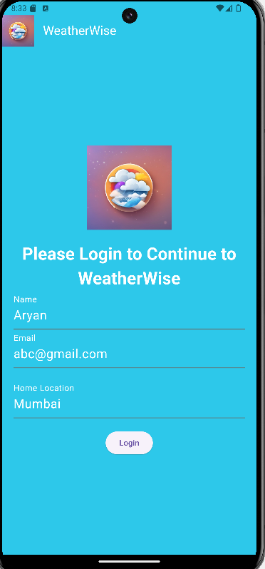
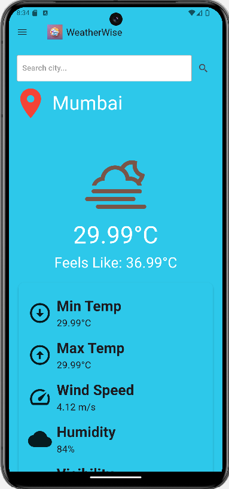
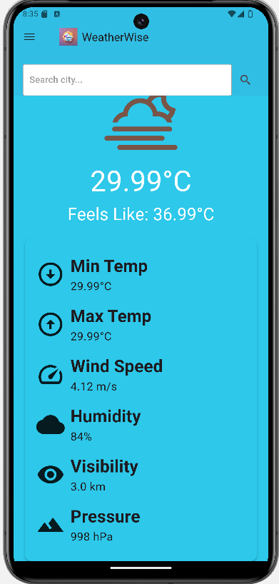
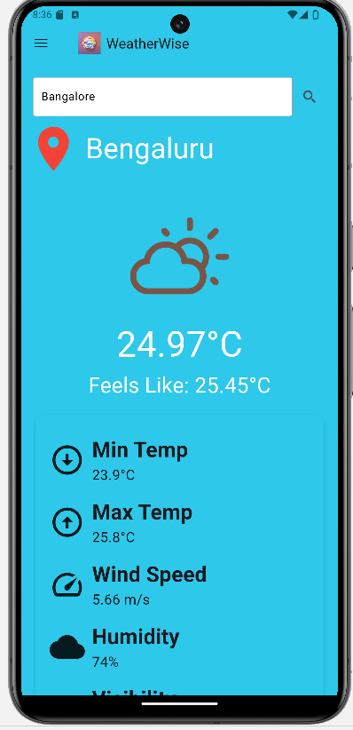
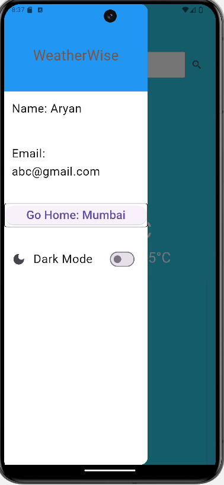
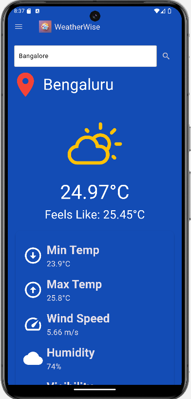

# Weather App

A Flutter application (using Dart) for displaying weather information using the OpenWeatherMap API.

## Libraries Used
- http: for accessing the OpenWeatherMap API
- shared_preferences: for storing data
- provider: for managing the state of the app
- weather_icons: for displaying the weather icons

## Splash Page

- The splash page is the loading page that pops up when the user opens the app.

## User Profile Page

- This page allows the users to input and store their basic profile information locally.
- It uses "shared_preferences" for local storage.

## Weather Screen

- Displays weather information for the user's home location upon opening.

- Shows detailed weather information such as temperature, weather conditions, wind speed, etc., for a city.
- It is vertically scrollable.

- Includes a search bar at the top to fetch and display weather for other cities.

## Menu Bar of Weather Screen

- Allows the user to go back to their home location by pressing on the "go back" button.

- Allows the user to toggle between dark and light mode based on their preferences.
